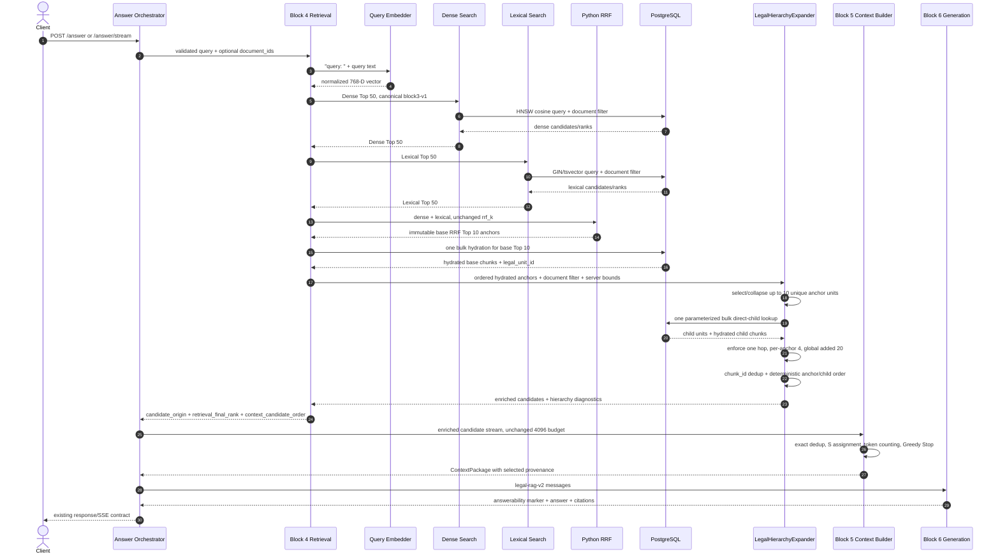
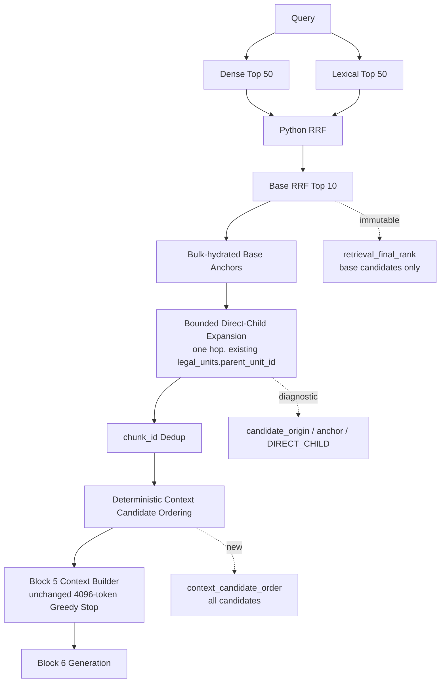
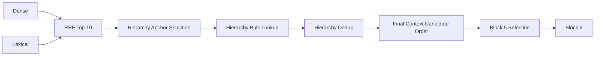

# Legal Hierarchy Retrieval V2 — Sequence and Data Flow

Status: **ACTIVE PRODUCTION FLOW — RE-FROZEN**

## Production sequence



If hierarchy enrichment fails after base hydration, `LegalHierarchyExpander` returns a diagnostic baseline fallback and Block 4 emits the unchanged base Top 10. No retry queue or second request is introduced.

## Data flow



## Rank and order distinction

```text
retrieval_final_rank
    Source: unchanged RRF Top 10
    Domain: 1..10 for RETRIEVAL; null for HIERARCHY_CHILD
    Meaning: ranking evidence from Dense/Lexical fusion

context_candidate_order
    Source: deterministic post-hierarchy merge
    Domain: 1..N for every candidate
    Meaning: exact sequence consumed by Block 5
```

No hierarchy child receives a dense, lexical, fusion, or RRF score/rank.

## Debug diagnostic stages



The future DebugTrace shows every stage independently. Frontend implementation is explicitly deferred.
